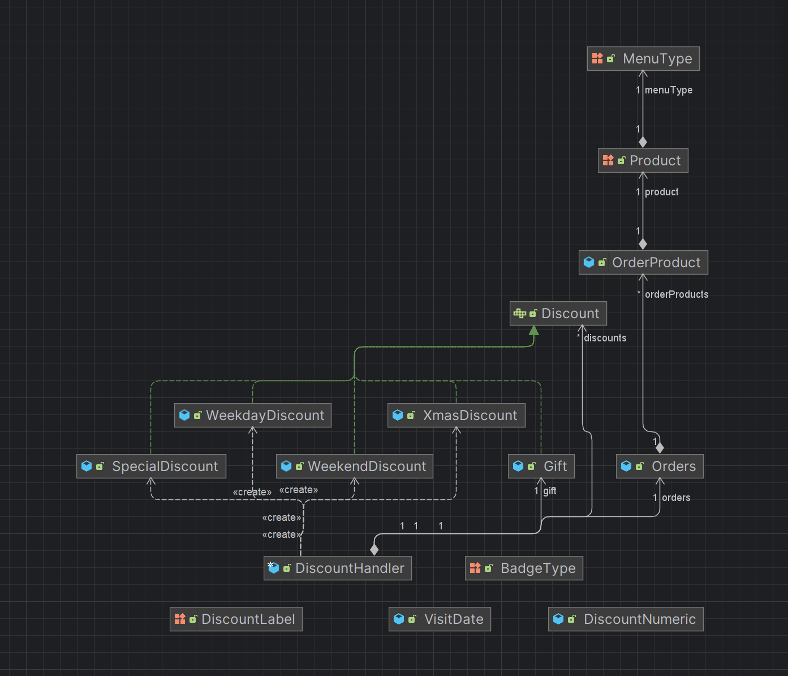

# 크리스마스 프로모션 모델링

---
- ## controller
  - ### `eventPlannerController`
---
- ## domain

  - ### 방문 날짜 - `VisitDate`
  
  - ### 주문 - `Orders`
    - 주문 메뉴 - `OrderProduct`
    - 방문 날짜 - `VisitDateDto`
    
  - ### 주문 메뉴 - `OrderProduct`
    - 주문 개수 - `count`
    - 주문 메뉴 - `Product`
    
  - ### discount
    - `DiscountHandler`
      - Discount 인터페이스 관리
    
    - `Discount` - interface 구현
      - #### strategies
        - 클스마스 디데이 할인 - `XmasDiscount`
        - 평일 할인 - `WeekdayDiscount`
        - 주말 할인 - `WeekendDiscount`
        - 특별 할인 - `SpecialDiscount`
        - 증정품 할인 - `Gift`
      - #### constants
        - String 상수 관리 - `DiscountLabel`
        - Numeric 상수 관리 - `DiscountNumeric`
  - ### VO
    - #### 주문 메뉴 - `MenuType` - enum
        - 에피타이저
        - 메인
        - 디저트
        - 음료
    - #### 메뉴 종류 - `Product` - enum
    - #### 이벤트 배지 - `EventBadgeType` - enum
---
- ## service
  - ### CalculateService
    - 할인 전 총 주문 금액 계산 - `CalculatePreTotalPrice`
    - 증정 품복 부여 여부 계산 - `calculateBenefits`
    - 금액에 따른 뱃지 타입 결정 계산 - `calculateBadgeType`
  - ### DiscountService
    - DiscountDto 생성 - `createDiscountDto`
    - 총 혜택 금액 계산 - `sumAllPrice`

---
- ## dto
  - ### `OrderDto`
  - ### `DiscountDto`
  - ### `BenefitDto`
  - ### `VisitDateDto`
---
- ## view
  - ### `InputView`
    - 식당 예상 방문 날짜 입력
    - 주문 메뉴와 개수 입력
  - ### `OutputView`
    - 이벤트 플래너 안내 문구 출력
    - 이벤트 혜택 안내 문구 출력
    - 주문한 메뉴 출력
    - 할인 전 총 주문 금액 출력
    - 증정 메뉴 제공 출력
    - 혜택 내역 출력
    - 총 혜택 금액 출력
    - 할인 후 예상 금액 출력
    - 이벤트 배지 출력
---
- ## util
  - ### format
    - #### `BadgeFormatUtil`
    - #### `DiscountFormatUtil`
    - #### `OrdersFormatUtil`
  - ### parser
    - #### `DateParserUtil`
    - #### `OrderParserUtil`
---
- ## validator
  - ### `userInputValidator`
---
- ## constants
  - ### `ErrorMessage`
  - ### `ViewMessage`
  - ### `Number`
    - 날짜 최소
    - 날짜 최대
    - 메뉴 개수 최소
    - 메뉴 개수 최대
    - 크리스마스 디데이 할인값 시작
    - 증정 메뉴 만족하는 금액
  - ### `Symbol`
