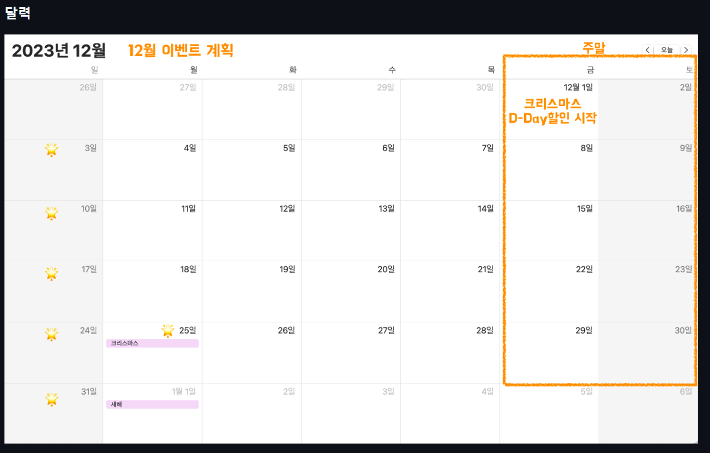

# 크리스마스 프로모션 기능 요구 사항
## 기능 목록 정리
### 1. 첫 안내 문구 출력
- [x] **이벤트 플래너 안내 문구 출력**
  - `"안녕하세요! 우테코 식당 12월 이벤트 플래너입니다."` 문구 출력
---
### 2. 방문 날짜 입력
- [x] **식당 예상 방문 날짜 입력 받기**
  - `"12월 중 식당 예상 방문 날짜는 언제인가요? (숫자만 입력해 주세요!)"` 문구 출력
- [x] **예외 처리** 
  - 숫자가 아닌 경우
  - 1~31의 범위가 아닌 경우
    
  문구 : `"[ERROR] 유효하지 않은 날짜입니다. 다시 입력해 주세요."`
---
### 3. 주문 메뉴와 개수 입력
- [x] **주문 메뉴와 개수 입력 받기**
  - `"주문하실 메뉴를 메뉴와 개수를 알려 주세요. (e.g. 해산물파스타-2,레드와인-1,초코케이크-1)"` 문구 출력
- [x] **예외 처리**
  - 메뉴판에 없는 메뉴를 입력하는 경우
  - 메뉴의 개수는 1보다 작은 경우
  - 메뉴 형식이 예시와 다른 경우
  - 중복 메뉴를 입력한 경우(e.g. 시저샐러드-1,시저샐러드-1)
  - 메뉴는 한번에 `최대 20개`까지만 주문 가능하다.
  - 음료만 주문시 주문할 수 없다.
  
  문구 : `"[ERROR] 유효하지 않은 주문입니다. 다시 입력해 주세요."`
---
### 4. 이벤트 혜택 안내 문구 출력
- [x] **이벤트 혜택 안내 문구 출력**
  - `"12월 26일에 우테코 식당에서 받을 이벤트 혜택 미리 보기!"` 문구 출력
---
### 5. 혜택 출력
- [x] **5-1. 주문한 메뉴 출력하기**
    - 주문 메뉴의 출력 순서는 제한 없음
    - 예시 출력은 다음과 같음
```text
<주문 메뉴>
타파스 1개
제로콜라 1개
```
- [x] **5-2. 할인 전 총주문 금액 출력하기**
  - 아래의 메뉴 참고하기 
  - 예시 출력은 다음과 같음
```text
<할인 전 총주문 금액>
8,500원
```
```text
<애피타이저>
양송이수프(6,000), 타파스(5,500), 시저샐러드(8,000)

<메인>
티본스테이크(55,000), 바비큐립(54,000), 해산물파스타(35,000), 크리스마스파스타(25,000)

<디저트>
초코케이크(15,000), 아이스크림(5,000)

<음료>
제로콜라(3,000), 레드와인(60,000), 샴페인(25,000)

```

- [x] **5-3. 증정 메뉴 제공 출력하기**
  - 할인 전 총주문 금액이 `12만 원` 이상일 때, `샴페인 1개` 증정
  - 증정 이벤트에 해당하지 않는 경우, 증정 메뉴 "없음"
  - 예시 출력은 다음과 같음
```text
<증정 메뉴>
없음
```
```text
<증정 메뉴>
샴페인 1개
```

- [x] **5-4. 혜택 내역 출력하기**
  - 총주문 금액 `10,000원` 이상부터 이벤트가 적용
  - 적용된 이벤트가 하나도 없다면 혜택 내역 "없음"으로 출력
  - 고객에게 적용된 이벤트 내역만 보여준다.
  - 혜택 내역에 여러 개의 이벤트가 적용된 경우, 출력 순서는 자유롭게 출력

  
  - [x] `크리스마스 디데이 할인`
      - 이벤트 기간: **2023.12.1 ~ 2023.12.25**
      - `1,000원`으로 시작하여 크리스마스가 다가올수록 날마다 할인 금액이 `100원`씩 증가
      - 총주문 금액에서 해당 금액만큼 할인  
        (e.g. 시작일인 12월 1일에 1,000원, 2일에 1,100원, ..., 25일엔 3,400원 할인)
  - [x] `평일 할인`(일요일 ~ 목요일): 평일에는 `디저트 메뉴`를 메뉴 1개당 `2,023원` 할인
  - [x] `주말 할인`(금요일, 토요일): 주말에는 `메인 메뉴`를 메뉴 1개당 `2,023`원 할인
  - [x] `특별 할인`: 이벤트 달력에 별이 있으면 `총주문 금액`에서 `1,000원` 할인
      - 
      - 매주 일요일 + 크리스마스 당일
  - [x] `이벤트 기간`: '크리스마스 디데이 할인'을 제외한 다른 이벤트는 **2023.12.1 ~ 2023.12.31** 동안 적용
  

  - 예시 출력은 다음과 같음
```text
<혜택 내역>
크리스마스 디데이 할인: -1,200원
평일 할인: -4,046원
특별 할인: -1,000원
증정 이벤트: -25,000원
```

- [x] **5-5. 총 혜택 금액 출력하기**
  - `총 혜택 금액` = `할인 금액의 합계` + `증정 메뉴의 가격`
  - 예시 출력은 다음과 같음
```text
<총혜택 금액>
-31,246원
```

- [x] **5-6. 할인 후 예상 금액 출력하기**
  - `할인 후 예상 결제 금액` = `할인 전 총주문 금액` - `할인 금액`
  - 예시 출력은 다음과 같음
```text
<할인 후 예상 결제 금액>
135,754원
```

- [ ] **5-7. 이벤트 배지 출력하기**
  - 총 혜택 금액을 기준으로
    - 5천 원 이상: 별
    - 1만 원 이상: 트리
    - 2만 원 이상: 산타
    - 이벤트 배지가 부여되지 않는 경우, "없음"
  - 예시 출력은 다음과 같음
```text
<12월 이벤트 배지>
산타
```
---
## 추가 조건
- [ ] IllegalArgumentException를 발생시키고, "[ERROR]"로 시작하는 에러 메시지를 출력 후 그 부분부터 입력을 다시 받는다.
  - Exception이 아닌 IllegalArgumentException, IllegalStateException 등과 같은 명확한 유형을 처리한다.
- [ ] JUnit 5와 AssertJ를 이용하여 본인이 정리한 기능 목록이 정상 동작함을 테스트 코드로 확인
- [ ] 입력과 출력을 담당하는 클래스를 별도로 구현한다.
